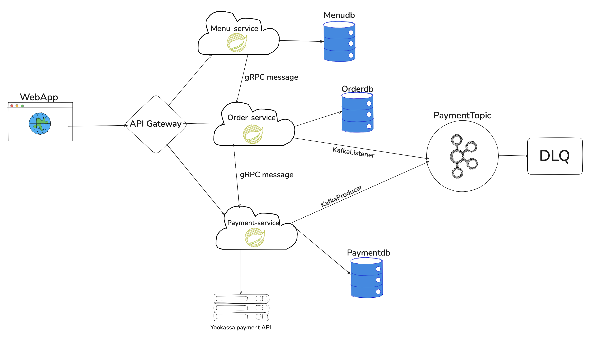

# 🍕 WebApp Microservices - Платформа заказа пиццы

<div align="center">



[](https://openjdk.org/)
[](https://spring.io/projects/spring-boot)
[](https://grpc.io/)
[](https://kafka.apache.org/)
[](https://www.postgresql.org/)
[](https://www.docker.com/)

### Enterprise-grade микросервисная платформа с асинхронной обработкой и gRPC коммуникацией

</div>

---

## 🚀 О проекте

**WebApp Microservices** — это современная высоконагруженная система для управления заказами пиццы, построенная по принципам микросервисной архитектуры. Проект демонстрирует использование передовых технологий и паттернов enterprise-разработки.

### 🎯 Ключевые особенности

- ⚡ **Асинхронная обработка** через Apache Kafka для высокой пропускной способности
- 🔌 **gRPC коммуникация** между сервисами для минимальных задержек
- 🛡️ **API Gateway** с паттерном Circuit Breaker и централизованной маршрутизацией
- 🗄️ **Разделение БД** — каждый микросервис со своей базой данных (Database per Service)
- 🐳 **Full Docker Compose** — полная контейнеризация всех компонентов
- 📊 **Observability** — Actuator для мониторинга здоровья сервисов
- 🔄 **Миграции БД** через Flyway для версионирования схемы
- 💳 **Интеграция с платежной системой** YooKassa
- 📖 **OpenAPI/Swagger** документация для всех REST API

---

## 🏗️ Архитектура

### Микросервисы

#### 🌐 API Gateway (`:8080`)
**Центральная точка входа** — единое окно для всех клиентских запросов.

- **Технологии**: Spring Cloud Gateway Server MVC, OpenFeign, Resilience4j
- **Функционал**:
  - Динамическая маршрутизация запросов к микросервисам
  - Circuit Breaker для отказоустойчивости
  - Централизованная обработка ошибок
  - Load balancing

#### 🍕 Menu Service (`:8081`)
**Управление меню** — CRUD операции с пиццами и их ценами.

- **Технологии**: Spring Boot, JPA, PostgreSQL, Flyway, gRPC Server
- **База данных**: `menu_db`
- **gRPC порт**: `9090`
- **Функционал**:
  - REST API для управления меню
  - gRPC эндпоинт `GetPizzasPrices` для быстрого получения цен
  - Валидация данных
  - MapStruct для маппинга DTO

#### 📦 Order Service (`:8082`)
**Обработка заказов** — создание, управление и расчёт стоимости заказов.

- **Технологии**: Spring Boot, JPA, PostgreSQL, Kafka Producer/Consumer, gRPC Client/Server
- **База данных**: `order_db`
- **gRPC порт**: `9091`
- **Функционал**:
  - Создание и отслеживание заказов
  - Расчёт итоговой стоимости через gRPC вызов в Menu Service
  - Публикация событий в Kafka при изменении статуса заказа
  - gRPC эндпоинт `GetOrderPrice` для Payment Service
  - Валидация бизнес-логики

#### 💰 Payment Service (`:8083`)
**Обработка платежей** — интеграция с платёжным шлюзом и управление транзакциями.

- **Технологии**: Spring Boot, JPA, PostgreSQL, Kafka Consumer, WebFlux, gRPC Client
- **База данных**: `payment_db`
- **Интеграция**: YooKassa API
- **Функционал**:
  - Создание платежей через YooKassa
  - Обработка webhook от платёжной системы
  - Реактивное взаимодействие с внешним API
  - Слушатель Kafka событий для автоматического создания платежей
  - gRPC клиент для получения стоимости заказа

#### 📚 Common Module
**Общая библиотека** — переиспользуемый код между сервисами.

- **Содержимое**:
  - Proto-файлы для gRPC контрактов
  - Общие DTO и утилиты
  - Базовые конфигурации

---

## 🔗 Коммуникация между сервисами

### gRPC (Синхронная)
```
Payment Service ──[gRPC]──> Order Service: GetOrderPrice
Order Service ──[gRPC]──> Menu Service: GetPizzasPrices
```

### Apache Kafka (Асинхронная)
```
Order Service ──[Kafka Event]──> Payment Service
  Topic: order-events
  Event: OrderStatusChanged
```

### REST API (Через Gateway)
```
Client ──[HTTP]──> API Gateway ──[REST]──> Microservices
```

---

## 🛠️ Технологический стек

### Backend
- **Java 21** — современная LTS версия с виртуальными потоками и record классами
- **Spring Boot 4.0.x** — последняя версия фреймворка
- **Spring Cloud 2025.1.0** — облачные паттерны (Gateway, OpenFeign, Circuit Breaker)
- **Spring Data JPA** — удобная работа с БД
- **gRPC 1.60.1** — высокопроизводительная межсервисная коммуникация
- **Apache Kafka 7.5** — распределенная потоковая обработка событий
- **Protocol Buffers 3.25** — эффективная сериализация данных

### Data & Storage
- **PostgreSQL 15** — надежная реляционная СУБД
- **Flyway** — версионирование и миграции БД

### Tools & Utilities
- **Lombok** — уменьшение boilerplate кода
- **MapStruct 1.6.3** — type-safe маппинг объектов
- **Gradle 8.x** — система сборки с multi-module поддержкой
- **Docker & Docker Compose** — контейнеризация и оркестрация

### Integration & Observability
- **OpenAPI/Swagger 3.0** — автогенерация API документации
- **Spring Boot Actuator** — health checks и метрики
- **Kafka UI** — удобный веб-интерфейс для мониторинга Kafka

---

## 🚀 Быстрый старт

### Предварительные требования

- Docker & Docker Compose
- Java 21 (если планируете локальную разработку)
- Gradle 8.x (опционально, используется wrapper)

### Запуск

1. **Клонируйте репозиторий**
```bash
git clone <repository-url>
cd WebAppMicroservices
```

2. **Создайте `.env` файл** в корне проекта:
```env
# PostgreSQL
POSTGRES_USER=postgres
POSTGRES_PASSWORD=postgres
POSTGRES_DB=postgres

# Services URLs
AUTH_SERVICE_URL=http://auth-service:8084
MENU_SERVICE_URL=http://menu-service:8081
ORDER_SERVICE_URL=http://order-service:8082
PAYMENT_SERVICE_URL=http://payment-service:8083

# Database URLs
MENU_DATASOURCE_URL=jdbc:postgresql://postgres:5432/menu_db
ORDER_DATASOURCE_URL=jdbc:postgresql://postgres:5432/order_db
PAYMENT_DATASOURCE_URL=jdbc:postgresql://postgres:5432/payment_db

# Kafka
SPRING_KAFKA_BOOTSTRAP_SERVERS=kafka:29092

# gRPC
MENU_SERVICE_GRPC_ADDRESS=static://menu-service:9090
ORDER_SERVICE_GRPC_ADDRESS=static://order-service:9091

# YooKassa (замените на свои)
YOOKASSA_SHOP_ID=your_shop_id
YOOKASSA_SECRET_KEY=your_secret_key
YOOKASSA_API_URL=https://api.yookassa.ru/v3
```

3. **Соберите проект**
```bash
./gradlew clean build
```

4. **Запустите все сервисы**
```bash
docker-compose up -d
```

5. **Проверьте статус**
```bash
docker-compose ps
```

Все сервисы должны быть в состоянии `healthy`.

---

## 📡 Endpoints

### API Gateway (`:8080`)
Точка входа для всех запросов:
- **Swagger UI**: http://localhost:8080/swagger-ui.html
- **Health Check**: http://localhost:8080/actuator/health

### Menu Service (`:8081`)
- **Swagger UI**: http://localhost:8081/swagger-ui.html
- **API**: http://localhost:8081/api/menu
- **Health Check**: http://localhost:8081/actuator/health
- **gRPC**: localhost:9090

### Order Service (`:8082`)
- **Swagger UI**: http://localhost:8082/swagger-ui.html
- **API**: http://localhost:8082/api/orders
- **Health Check**: http://localhost:8082/actuator/health
- **gRPC**: localhost:9091

### Payment Service (`:8083`)
- **Swagger UI**: http://localhost:8083/swagger-ui.html
- **API**: http://localhost:8083/api/payments
- **Health Check**: http://localhost:8083/actuator/health

### Kafka UI (`:8090`)
- **Web Interface**: http://localhost:8090
- Просмотр топиков, сообщений, consumer groups

---

## 🧪 Примеры API запросов

### Создать пиццу (Menu Service)
```bash
curl -X POST http://localhost:8081/api/menu/pizzas \
  -H "Content-Type: application/json" \
  -d '{
    "name": "Маргарита",
    "description": "Классическая пицца с моцареллой",
    "price": 599.00,
    "size": "MEDIUM"
  }'
```

### Создать заказ (Order Service)
```bash
curl -X POST http://localhost:8082/api/orders \
  -H "Content-Type: application/json" \
  -d '{
    "customerId": 1,
    "items": [
      {
        "pizzaId": 1,
        "quantity": 2
      }
    ]
  }'
```

### Создать платёж (Payment Service)
```bash
curl -X POST http://localhost:8083/api/payments \
  -H "Content-Type: application/json" \
  -d '{
    "orderId": 1,
    "amount": 1198.00,
    "currency": "RUB"
  }'
```

---

## 🏛️ Архитектурные паттерны

### ✅ Реализованные паттерны

- **API Gateway Pattern** — централизованная точка входа
- **Database per Service** — изоляция данных каждого сервиса
- **Event-Driven Architecture** — асинхронная коммуникация через Kafka
- **Circuit Breaker** — защита от каскадных отказов (Resilience4j)
- **Health Check Pattern** — мониторинг состояния сервисов
- **Saga Pattern** (упрощённая версия) — распределённые транзакции через события
- **Repository Pattern** — абстракция работы с данными
- **DTO Pattern** — разделение доменных моделей и API контрактов

---

## 📊 Мониторинг и Observability

### Health Checks
Все сервисы предоставляют эндпоинты для проверки здоровья:
```bash
# Проверить все сервисы
curl http://localhost:8080/actuator/health  # API Gateway
curl http://localhost:8081/actuator/health  # Menu Service
curl http://localhost:8082/actuator/health  # Order Service
curl http://localhost:8083/actuator/health  # Payment Service
```

### Kafka Monitoring
Kafka UI доступен по адресу: http://localhost:8090
- Просмотр топиков и партиций
- Мониторинг consumer lag
- Просмотр сообщений в реальном времени

---

## 🗄️ База данных

### Структура
Каждый сервис имеет свою изолированную БД:
- `menu_db` — меню и пиццы
- `order_db` — заказы и позиции
- `payment_db` — платежи и транзакции

### Миграции
Flyway автоматически применяет миграции при старте сервисов.
Миграции находятся в `src/main/resources/db/migration/` каждого сервиса.

---

## 🧩 Модульность проекта

```
WebAppMicroservices/
├── common/                    # Общие компоненты
│   └── src/main/proto/       # gRPC контракты
├── api-gateway/              # API Gateway
├── menu-service/             # Menu Service
├── order-service/            # Order Service
├── payment-service/          # Payment Service
├── docker-compose.yml        # Оркестрация контейнеров
├── init-databases.sql        # Инициализация БД
└── build.gradle              # Root конфигурация Gradle
```

---

## 🔧 Разработка

### Сборка отдельного сервиса
```bash
./gradlew :menu-service:build
./gradlew :order-service:build
./gradlew :payment-service:build
./gradlew :api-gateway:build
```


### Генерация gRPC классов
```bash
./gradlew :common:generateProto
```

### Пересборка и перезапуск сервиса
```bash
./gradlew :menu-service:build
docker-compose up -d --build menu-service
```

---


### 🚀 Возможные улучшения:

- Добавить распределённый трейсинг (Zipkin/Jaeger)
- Централизованное логирование (ELK Stack)
- Kubernetes манифесты для prod deployment
- Мониторинг метрик (Prometheus + Grafana)
- CI/CD пайплайн (GitHub Actions/Jenkins)
- Аутентификация и авторизация (JWT/OAuth2)
- Rate limiting на Gateway

---


## 👨‍💻 Автор

D1ff1cult42

---

<div align="center">

### ⭐ Если проект понравился — поставьте звезду!

**Built with:** Java 21 • Spring Boot 4.0 • gRPC • Kafka • PostgreSQL • Docker

</div>

